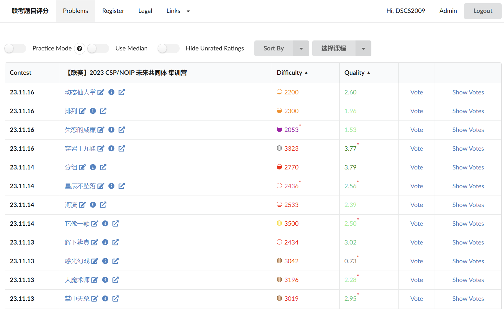

# Liankao Rating
[Liankao Rating](https://vote2.dscs2009.com/) is a tool forked from [USACO-Rating](https://github.com/CodeTiger927/USACO-Rating) to estimate the difficulties of Liankao problems in terms of CodeForces rating.

# Deploy

1. install python3-flask

2. run `python3 -m backend.app`